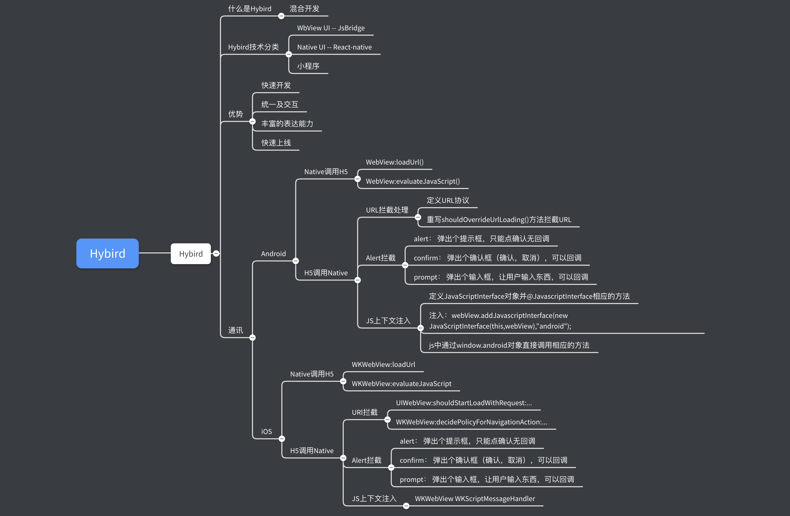
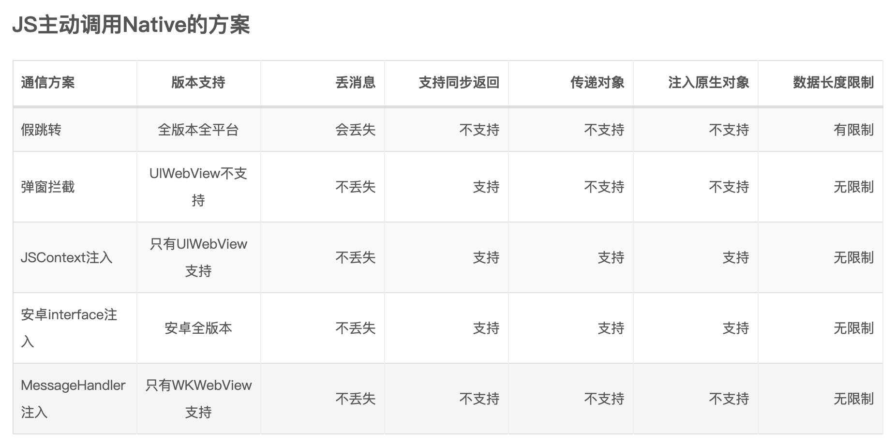
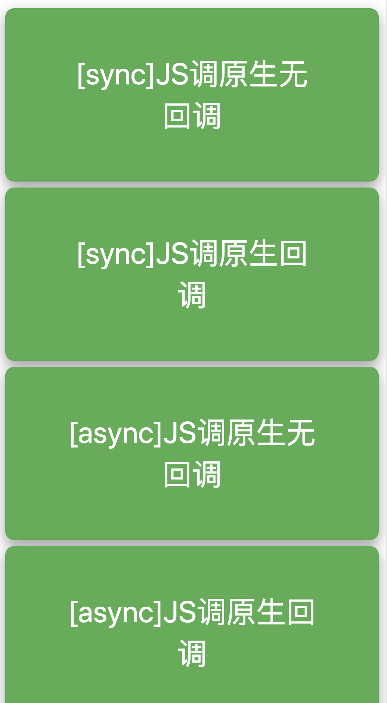
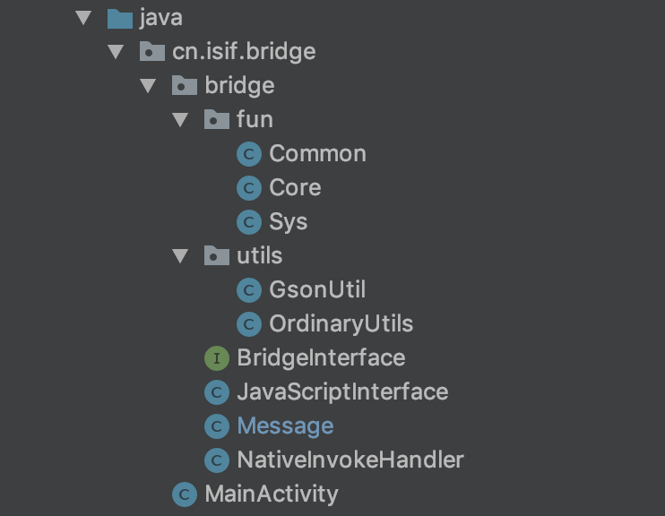

# Hybird方案

# 调研篇

## Question1：什么是Hybird？

Hybird其实是对混合应用开发技术的一种俗称，所谓的混合应用开发技术是指融合了Native和Web的开发技术（Native是指各个平台原生能力，比如：Android使用的Java/Kotlin语言能力，而iOS使用的Objective-C或Swift），这种技术的诞生其实质是模糊了前端开发的边界，也让前端实现了到大前端的跃进。

## Question2：目前市面上都有哪些Hybird方案？

关于目前市面上Hybird框架其量不可偻指算，但其技术方案主要基于以下几种：

1. 基于Webview UI的基础方案。市面上主流，例如微信SDK，通过JsBridge完成H5和Native的双向通讯，从而赋予H5一定的原生能力。
2. 基于Native UI的方案，例如React-native、Weex等。在赋予H5原生API能力的基础上，进一步通过JsBridge将js解析成虚拟dom传递到native，并使用原生渲染。
3. 小程序方案。通过定制化的JsBridge，使用双Webview和双线程的模式隔离了JS逻辑和UI渲染，形成特殊的开发模式，加强了H5和原生的混合程度，提高了页面性能和开发体验。

## Hybird优势

Hybird技术带来的优势有很多，通过学习和实际应用，我总结了如下几点：

- 快速开发
- 统一了交互UI
- 借助于H5强大的表现能力，是App表达更加丰富
- 无等待上线 👍

## 技术方案

本篇讨论的范畴限于上面介绍的第一种技术方案，即通过JsBridge完成H5和Native的双向通讯，下面就Android和iOS平台分别说明。

### Android

- **Native调用H5**

在Android中Native调用H5主要有两种方式：

- `webView.loadUrl("javascript: alert( 'hello world' )");`
- `webView.evaluateJavascript(String script, @RecentlyNullable ValueCallback<String> resultCallback);`

第一种是针对没有返回值情况的，第二种可以接受返回值。

- **H5调用Native**

即JS调Native，在Android端有URL拦截处理、Alert拦截、JS上下文注入。

**首先，URL拦截处理**

URL拦截处理是指JS将要和Java通讯的内容包装成URL，Android端重载`shouldOverrideUrlLoading()`方法，来处理JS请求，例如：

    <a href="msg://modleName/actionMethod?params=123...">发送消息<a>

在Android中，我们可以处理该消息

    @Override
    public boolean shouldOverrideUrlLoading(WebView view, String url) {
        //1 根据url，判断是否是所需要的拦截的调用 例如：msg
        if (是){
          //2 取出路径，确认要发起的native调用的指令是什么
          //3 取出参数，拿到JS传过来的数据
          //4 根据指令调用对应的native方法，传递数据
          return true;
        }
        return super.shouldOverrideUrlLoading(view, url);
    }

可以看到，这种方式整体实现起来也比较优雅，也便于设计协议，但是这个方式有个致命的缺陷，那就是丢消息。

**再看，Alert拦截**

Android可以拦截JS的三种Alert，即

- `alert()`弹出个提示框，只能点确认无回调
- `confirm()`弹出个确认框（确认，取消），可以回调
- `prompt()`弹出个输入框，让用户输入东西，可以回调

这些弹框都可以传递一个字符串，而这字符就可以被用来设计我们的消息。这里，我只示例prompt这一个方式，其他情况类似哈。

    <html>
    
    
    <body>
    

JS调Native

    

prompt

    </body>
    </html>

上面就是我们html部分，接下来我们看看如何在java中处理消息。

    wv_web.setWebChromeClient(new WebChromeClient() {
    @Override
    public boolean onJsAlert(WebView view, String url, String message, JsResult result) {
    
        return super.onJsAlert(view, url, message, result);
    }
    
    @Override
    public boolean onJsPrompt(WebView view, String url, String message, String defaultValue, JsPromptResult result) {
    		try {
    
    					//这里处理的逻辑是：先将message解析，获的action，再判断是否拦截该弹框
    					SONArray jsonArray = new JSONArray(message);
    					SONObject jObject = jsonArray.getJSONObject(0);
    
    					if (jObject.has("action")) {
    							String params = jObject.getString("params");
    							Log.d("MainActivity", params);
                  result.confirm(params);
                  return true;
                        }
                    } catch (JSONException e) {
                        e.printStackTrace();
                    }
    
                    return super.onJsPrompt(view, url, message, defaultValue, result);
        }
    });

**最后，我们来看JS上下文注入**

移步实践篇

至此，咱们Android端就介绍到这里。

### iOS

- **Native调用H5**
    - loadUrl 浏览器用’javascript:’+JS代码做跳转地址，WKWebView官方提供了一个Api，可以让WebView在加载页面的时候，自动执行注入一些预先准备好的JS
    - 使用WKWebView的`evaluateJavascript`方法，加载时机可选择`WKUserScriptInjectionTimeAtDocumentStart`或者`WKUSerScriptInjectionTimeAtDocumentEnd`
- **H5调用Native**

同Android一样，iOS调用JS也有三种方式。

**第一种，假URL跳转拦截。**

URL构造方式同Android一样，这里就不再过多赘述了。

iOS的UIWebView的拦截方式 webView:shouldStartLoadWithRequest:navigationType:

    - (BOOL)webView:(UIWebView *)webView shouldStartLoadWithRequest:(NSURLRequest *)request navigationType:(UIWebViewNavigationType)navigationType
    {
        //1 根据url，判断是否是所需要的拦截的调用 判断协议/域名
        if (是){
          //2 取出路径，确认要发起的native调用的指令是什么
          //3 取出参数，拿到JS传过来的数据
          //4 根据指令调用对应的native方法，传递数据
          return NO;
          //确认拦截，拒绝WebView继续发起请求
        }    
        return YES;
    }

iOS的WKWebView的拦截方式 webView:decidePolicyForNavigationAction:decisionHandler:

    - (void)webView:(WKWebView *)webView decidePolicyForNavigationAction:(WKNavigationAction *)navigationAction decisionHandler:(void (^)(WKNavigationActionPolicy))decisionHandler {
        //1 根据url，判断是否是所需要的拦截的调用 判断协议/域名
        if (是){
          //2 取出路径，确认要发起的native调用的指令是什么
          //3 取出参数，拿到JS传过来的数据
          //4 根据指令调用对应的native方法，传递数据
          //确认拦截，拒绝WebView继续发起请求
            decisionHandler(WKNavigationActionPolicyCancel);
        }else{
            decisionHandler(WKNavigationActionPolicyAllow);
        }
        return YES;
    }

**第二种，弹框拦截**

同Android一样，三种方式我只介绍一种：

    //WKWebView webView:runJavaScriptTextInputPanelWithPrompt:...
    - (void)webView:(WKWebView *)webView runJavaScriptTextInputPanelWithPrompt:(NSString *)prompt defaultText:(nullable NSString *)defaultText initiatedByFrame:(WKFrameInfo *)frame completionHandler:(void (^)(NSString * _Nullable result))completionHandler{
        //1 根据传来的字符串反解出数据，判断是否是所需要的拦截而非常规H5弹框
        if (是){
            //2 取出指令参数，确认要发起的native调用的指令是什么
            //3 取出数据参数，拿到JS传过来的数据
            //4 根据指令调用对应的native方法，传递数据
            //直接返回JS空字符串
            completionHandler(@"");
        }else{
            //直接返回JS空字符串
            completionHandler(@"");
        }
    }

**第三种，JS上下文注入**

- UIWebview JavaScriptCore注入

UIWebView可以通过KVC的方法，直接拿到整个WebView当前所拥有的JS上下文。

    documentView.webView.mainFrame.javaScriptContext

拿到了JSContext，一切的使用方式就和直接操作JavaScriptCore没啥区别了，我们可以把任何遵循JSExport协议的对象直接注入JS，让JS能够直接控制和操作。

具体，略。

## 如何选择？

# 实践篇

## 满足Hybird开发，WebView应具备的基础功能

- 良好的JS与原生通讯交互能力
- 灵活的业务模块扩展能力
- Cookie管理
- 本地加载JS管理

## 通讯交互能力

- JS主动调用原生
- JS主动调用原生后回调
- 原生主动调用JS
- 原生主动调用JS后回调
- 同步通讯
- 通讯编码
- JS框架应该具备处理native侧生命周期的能力。比如：App切换到前台。【具体的业务处理，JS框架层可以交给JS业务开发处理即可，就像native开发中的生命周期模板方法一样】

以上就是对我们的Hybird框架的基本期望，接下来我们看看如何实现吧。备注：本次案例我们以Android实现来做分析，iOS实现部分请参考[「案例」](http://awhisper.github.io/2018/03/06/hybrid-webcontainer/)。

### 通讯协议

好了，该介绍的基本情况也介绍完毕了，我们来看看具体如何实现吧！Bybird框架中最重要的就是原生与web之间的通讯，要通讯我们就得制订通讯协议，为了保证基本的业务能力和可扩展性，我们的协议不仅要能表达相应的业务事件，而且还需要能够实现非业务事件，具体协议如下：

    public class Message {
        public String handler;//定义native层对外的方法调用类
        public String action;//相应的native方法
        public String params;//参数传递
        public String callbackId;//用于标识JS回调函数的id
        public String callbackFunction;//用于分发处理js回调函数
    }

协议类中具体字段的含义我已在代码中注明，这里就不再赘述了。好了协议类我们有了，我们该如何实现通讯部分呢？

### JS调用Native

我们先来看看JS调用Native层，前面调研篇我们已经讲到要实现JS调用Native，我们有三种方案（具体方案参考上部分），这里我们选择JS上下文注入的方式，为什么会选择这种方案呢？从实现功能的角度来讲除了URL拦截，alert拦截和JS注入都可以满足我们的要求，但是从框架设计的角度来讲，为了设计的优雅和框架结构上来看，JS注入要相对优雅些，大家可以对照着之前来对比下面的实现就知道了。好了，闲话少叙，我们先看JS部分。

    <html>
    <head>
        
        
    </head>
    <body>
    
<button onclick="sendSyncNormalMessage()" class="button button1">[sync]JS调原生无回调</button>

    
<button onclick="sendSyncCallbackMessage()" class="button button1">[sync]JS调原生回调</button>

    
<button onclick="sendAsyncNormalMessage()" class="button button1">[async]JS调原生无回调</button>

    
<button onclick="sendAsyncCallbackMessage()" class="button button1">[async]JS调原生回调</button>

    </body>
    </html>

UI样式就这个样子：

这个Html5页面非常简单，就4个按钮分别描述了本框架的核心功能，JS调用Native部分基本覆盖，对应的JS脚本如下：

    var msgCallbackMap = [];//定一个了一个map对象，用来存储回调函数
    //该函数用来分发回调处理
    function callbackDispatcher(callbackId,params){
        var handler = this.msgCallbackMap[callbackId];
        if(handler && typeof(handler) === 'function'){
            console.log(params);
            var resultObj = params ? JSON.parse(params) : {};
            handler(resultObj);
        }
        delete this.msgCallbackMap[callbackId];
    }
    
    //获取系统类型
    function getOS(){
        var u = navigator.userAgent;
    //    var isAndroid = u.indexOf('Android') > -1 || u.indexOf('Adr') > -1; //android终端
    //    var isiOS = !!u.match(/\(i[^;]+;( U;)? CPU.+Mac OS X/); //ios终端
        if(u.indexOf('Android') > -1 || u.indexOf('Adr') > -1){
            return 'Android';
        }else if(!!u.match(/\(i[^;]+;( U;)? CPU.+Mac OS X/)){
            return 'iOS';
        }else {
            return 'iOS';
        }
    }
    //发送同步消息
    function sendSyncMessage(data){
        if(getOS()=='Android'){
            return window.android.handleSyncMessage(JSON.stringify(data));
        }else{
            //ios
           window.webkit.messageHandlers.BTJSBridge.postMessage(data);
        }
    
    }
    //发送异步消息
    function sendAsyncMessage(data){
        if(getOS()=='Android'){
            return window.android.handleAsyncMessage(JSON.stringify(data));
        }else{
            //ios
            window.webkit.messageHandlers.BTJSBridge.postMessage(data);
        }
    }
    //用于生成回调函数的id
    function getCallbackId(){
        var timestamp = Date.parse(new Date());
        timestamp = timestamp / 1000;
        return timestamp;
    }
    //这是一个测试函数，用来测试回调用的，在具体使用场景中应替换成相应的函数
    function testCallback(params){
        window.alert('native回调返回：'+ params);
    }
    //发送同步无回调消息
    function sendSyncNormalMessage(){
        var msgBody = {};
        msgBody.handler = 'Common';
        msgBody.action = 'nativeLog';
        msgBody.params = "massage content";
    
        window.alert(sendSyncMessage(msgBody));
    }
    
    //发送同步回调消息
    function sendSyncCallbackMessage(){
        var msgBody = {};
        msgBody.handler = 'Core';
        msgBody.action = 'getUserID';
        msgBody.params = "";
        var callbackId = getCallbackId();
        this.msgCallbackMap[callbackId] = testCallback;
        msgBody.callbackId = callbackId;
        msgBody.callbackFunction = 'callbackDispatcher';
        sendSyncMessage(msgBody);
    }
    //发送异步无回调消息
    function sendAsyncNormalMessage(){
        var msgBody = {};
        msgBody.handler = 'Common';
        msgBody.action = 'nativeLog';
        msgBody.params = "massage content";
        sendAsyncMessage(msgBody);
    }
    //发送异步有回调消息
    function sendAsyncCallbackMessage(){
        var msgBody = {};
        msgBody.handler = 'Core';
        msgBody.action = 'getUserID';
        msgBody.params = "";
        var callbackId = getCallbackId();
        this.msgCallbackMap[callbackId] = testCallback;
        msgBody.callbackId = callbackId;
        msgBody.callbackFunction = 'callbackDispatcher';
        sendAsyncMessage(msgBody);
    }

关于上面的JS脚本，这里需要说明一下，由于咱们这是演示案例，通讯对象的创建在函数中处理的，但在真实使用场景中应该将消息对象的创建包装起来，消息的创建应该包含框架sdk中，不应该将这么核心的对象暴露给用户，这是面向对象设计的原则。从上面的JS脚本中我们可看到我们协议对象设计的重要性了，它的表达能力就是我们功能设计的边界，四种场景基本满足我们的需求了，以后基于业务扩展也基本没有问题的。

上面就是我们的web部分了，下面我来看看在我们Android端是如何设计，并完成JS与它通讯的呢？

我们看到这个结构还是非常简单的。fun包下就是我们对外提供的api，Common表示一些基础的功能；Core提供了与业务相关的操作；Sys用于封装一些与系统相关操作的api。这个设计是很灵活的，实际使用中不一定按照这样，根据具体业务而定。utils包中是一些用到的工具方法，由于篇幅问题这里不再细说了。剩下的这个几个类中JavaScriptInterface就是我们这个核心实现了，我们来看一下吧。

    		//处理同步消息
    		@JavascriptInterface
        public String handleSyncMessage(String params) {
            Log.i(TAG, "handleMessage 是否发生在主线程：" + (Looper.myLooper() == Looper.getMainLooper()));
            return executeMethod(params);
        }
    
        @JavascriptInterface
        public void handleAsyncMessage(String params) {
    				//使用AsyncTask处理异步消息
            new AsyncTask<String,Integer,String>(){
    
                @Override
                protected String doInBackground(String[] objects) {
                    try {
                        Thread.sleep(3_000);
                    } catch (InterruptedException e) {
                        e.printStackTrace();
                    }
                    Log.i(TAG, "handleMessage 是否发生在主线程：" + (Looper.myLooper() == Looper.getMainLooper()));
                    return executeMethod(objects[0]);
                }
            }.execute(params);
        }
    		//实际处理消息的方法
        private String executeMethod(String params){
            try {
                Log.d("JavaScriptInterface",params);
                Message msg = GsonUtil.fromJsonToModel(params,Message.class);
                if (msg.isCallbackMessage()){
                    return handleCallbackMessage(msg);
                }else {
                    return  handleNormalMessage(msg);
                }
    
            } catch (Exception e) {
                e.printStackTrace();
                return e.getMessage();
            }
        }
    		
    		//invoke函数：执行相应的方法
        @Override
        private String handleNormalMessage(Message msg) {
            try {
                return NativeInvokeHandler.invoke(msg).toString();
            } catch (Exception e) {
                e.printStackTrace();
                return e.getMessage();
            }
        }
    		
    		//
        @Override
        private String handleCallbackMessage(Message msg) {
            try {
                if (!TextUtils.isEmpty(msg.callbackId) && !TextUtils.isEmpty(msg.callbackFunction)) {
                    String call = "javascript:" + msg.callbackFunction + "(" + msg.callbackId + "," + System.currentTimeMillis() + ")";//JS此方法的返回值会通过onReceiveValue回调到原生
                    new Handler(Looper.getMainLooper()).post(() -> webView.evaluateJavascript(call, value -> {
                        Log.i(TAG, "ValueCallback 是否发生在主线程：" + (Looper.myLooper() == Looper.getMainLooper()));//true
                        Toast.makeText(context, "JS方法返回" + value, Toast.LENGTH_SHORT).show();
                    }));
                }
                return NativeInvokeHandler.invoke(msg).toString();
            } catch (Exception e) {
                e.printStackTrace();
                return e.getMessage();
            }
        }

该类中对外公开的两个方法（`public String handleSyncMessage(String params)` 和`public void handleAsyncMessage(String params)`）就是我们注入到JS中的方法，分别对应的同步消息和异步消息，我们在Android中使用`webView.addJavascriptInterface(new JavaScriptInterface(this,webView),"android");`即可注入JS中，在JS中我就可以使用android对象进行调用了。

### Native调用JS

自此，通讯中JS调用Native部分，我们就到这了，Nativie调用JS部分其实我不用做过多的处理，在Android我们调用JS代码有两种方式：`loadUrl`和`evaluateJavascript`。推荐使用`evaluateJavascript`，它不仅能处理无返回值，还能处理带返回值函数类型。

### 编码方案

在JS与Native通讯时，通讯协议对象是我们两个环境通讯的基础桥梁，我们将协议对象在两个环境下的转换形式定义为编码（即面向对象的中的序列化操作），对象本身编码的效率和稳定直接决定了这个框架的质量。本案例中使用json作为对象序列化和反序列化的介质，其优势在于可以利用现有的三方框架对编码进行托管。

## Cookie管理

Cookie作为Web端本地储存数据的重要方式之一，其作用不言而喻。在设计中Android平台主要涉及到Cookie同步的问题，关于如何处理Cookie同步问题请参考【[Cookie同步](https://www.jianshu.com/p/c9a9c4e1756d)】。本案例中，我们使用Native层提供存储api的方式来代替Cookie机制，原理同JS调用Native一样。

## 参考

- [Android混合H5进行Hybrid开发的探索](https://zhuanlan.zhihu.com/p/22186151?refer=c_46929389)
- [Hybrid APP架构设计思路](https://github.com/chemdemo/chemdemo.github.io/issues/12)
- [从零收拾一个hybrid框架（一）-- 从选择JS通信方案开始](http://awhisper.github.io/2018/01/02/hybrid-jscomunication/)
- [从零收拾一个hybrid框架（二）-- WebView容器基础功能设计思路](http://awhisper.github.io/2018/03/06/hybrid-webcontainer/)
- [Android：你要的WebView与JS交互方式都在这里了](https://blog.csdn.net/carson_ho/article/details/64904691)
- [Android 控件WebView设置Cookie](https://www.jianshu.com/p/c9a9c4e1756d)