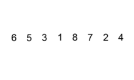

# 归并法排序和插入法排序

## 归并法排序
【核心思想】
归并排序（Merge）核心思想是merge，是将两个（或两个以上）**有序序列**合并成一个新的**有序序列**，即把待排序序列分为若干个子序列，每个子序列是有序的。然后再把有序子序列合并为整体有序序列。
【图解算法】

- 1、把元素分成两部分，对每一个部分采用递归的归并排序。
- 2、比较已经排好序的元素。
- 3、合并已经排好序的元素。
- 4、排序完毕。


```java
public class MergeSort {

    public static void sort(int[] arr, int left, int right) {
        if (left >= right) return;
        int center = (left + right) / 2;
        sort(arr, left, center);
        sort(arr, center + 1, right);
        merge(arr, left, center, right);
    }

    public static void merge(int[] arr, int left, int center, int right) {
        //定义一个临时数组用来临时存放数据
        int[] tempArray = new int[arr.length];
        int k = center + 1;//标识右边的数组下标指针
        int tIndex = left;//指向临时数组下标指针
        int temp = left;//标识操作的起始下标，方便最后复制到实际的数组中
        while (left <= center && k <= right) {
            if (arr[left] >= arr[k]) {
                tempArray[tIndex++] = arr[k++];
            } else {
                tempArray[tIndex++] = arr[left++];
            }
        }
        while (left <= center) {
            tempArray[tIndex++] = arr[left++];
        }
        while (k <= right) {
            tempArray[tIndex++] = arr[k++];
        }
        //数组复制
        while (temp <= right) {
            arr[temp] = tempArray[temp++];
        }

    }

    public static void main(String[] args) {
        int[] data = new int[]{5, 3, 6, 2, 1, 9, 4, 8, 7};
        sort(data, 0, data.length - 1);
        for (int a : data) {
            Log.println(a);
        }
    }
}
```

## 插入法排序

### 直接插入法
【核心思想】
插入法排序是一种简单的排序方法，其核心思想是将一个元素插入到一个有序序列中，从而得到一个新的有序序列。
【图解算法】

实现如下：
```java
public class InsertionSort {
    public static int[] insertionSort(int[] arr) {
        int j, target;
        for (int i = 1; i < arr.length; i++) {
            j = i;
            target = arr[i];
            while (j > 0 && target < arr[j - 1]) {
                arr[j] = arr[j - 1];
                j--;
            }
            arr[j] = target;
        }
        return arr;
    }
    public static void main(String[] args) {
        int[] arr = {7, 1, 4, 2, 6, 3, 9, 8, 5};
        for (int a : insertionSort(arr)){
            System.out.println(a);
        }
    }
}
```
我们来分析一个这个算法，假设存在这样一个数组[1,2,3,4,5,6]，可以看到这个数组本身就是一个有序的数组，如果我们需要得到一个升序的结果话，使用直接插入法，其时间复杂度为O(n)；如果我们要得到一个降序的序列呢？很容易我们得到其时间复杂度为O(n^2)；由此我们可以得出该算法的时间复杂度为O(n^2)。

**如果需要我们针对该算法进行优化的话？我们可以从哪些方向入手呢？**

### 二分插入法(基于查找优化)
【核心思想】
由直接插入法排序算法分析我们知道，该算法在查找插入的位置时，是采用的是一个一个的比较的方式，这显然是比较耗时的操作，既然是查找我们可以想到一种比较高效的查找方式——二分法查找，由此我们引入基于直接插入的法优化方案——二分插入法。
其核心思想是使用二分插入法优化寻找插入位置。
【图解算法】


```java
class InsertionSort {
    public static int[] insertionSort(int[] arr) {
        int idx, target;
        for (int i = 1; i < arr.length; i++) {
            target = arr[i];
            idx = halfQ(arr, 0, i-1, target);
            for (int j = i-1;j >= idx;j--){
                arr[j+1] = arr[j];
            }
            arr[idx] = target;
        }
        return arr;
    }

    public static int halfQ(int[] arr, int low, int high, int d) {
        int mid = 0;
        while (low <= high) {
            mid = low + (high - low) / 2;
            if (arr[mid] > d ) {
                high = mid - 1;
            }else {
                low = mid + 1;
            }

        }
        return low;
    }

    public static void main(String args[]) {
        int[] arr = {7, 1, 4, 2, 6, 3, 9, 8, 5};
        for (int a : insertionSort(arr)) {
            System.out.println(a);
        }
    }

}
```

### 希尔排序
【核心思想】
**我们通过前面可以知道直接插入法排序，对基本有序的序列十分高效，那么我们能否基于此改进算法，使其对一般序列也保持一定的高效行呢？**

答案是肯定的，这就是我们即将要讲到的希尔排序，其基本思想就是：**先将整个待排序的记录序列分割成为若干子序列分别进行直接插入排序，待整个序列中的记录“基本有序”时，再对全体记录进行依次直接插入排序。**
【图解算法】

其实现如下
```java
public class ShellSort {

    public static int[] shellSort(int[] arr) {
        int i, j;
        int length = arr.length;
        int gap = length;
        while (gap > 1) {
            gap = gap / 2;
            for (i = 0; i < gap; i++) {
                for (j = i + gap; j < length; j += gap) {
                    if (arr[j] < arr[j - gap]) {
                        int temp = arr[j];
                        int k = j - gap;
                        while (k >= 0 && arr[k] > temp) {
                            arr[k + gap] = arr[k];
                            k -= gap;
                        }
                        arr[k + gap] = temp;
                    }
                }
            }
        }
        return arr;
    }

    public static void printArray(int[] arr) {
        for (int a : arr) {
            System.out.println(a);
        }
    }

    public static void main(String[] args) {
        int[] arr = {7, 1, 4, 2, 6, 3, 9, 8, 5, 10, 20, 19, 11, 18, 12, 17, 13, 16, 14, 15};
        printArray(shellSort(arr));
    }
}
```
## 拓展
- 在数组中的两个数字如果前面一个数字大于后面的数字，则这两个数字组成一个逆序对。输入一个数组，求出这个数组中的逆序对的总数。

**参考**
- https://blog.csdn.net/jiange_zh/article/details/50698964
- http://www.cutey.us/2010/12/merging-sort-and-its-application