# 1、**最短路径问题**

​        **最短路径问题是图论研究中的一个经典算法问题，旨在寻找图（由结点和路径组成的）中两结点之间的最短路径。** 

算法具体的形式包括：

- **确定起点的最短路径问题** - 即已知起始结点，求最短路径的问题
- **确定终点的最短路径问题** - 与确定起点的问题相反，该问题是已知终结结点，求最短路径的问题
- **确定起点终点的最短路径问题** - 即已知起点和终点，求两结点之间的最短路径
- **全局最短路径问题** - 求图中所有的最短路径

# 2、最短路径问题几种算法

- **Dijkstra算法**
- **A*算法**
- **Bellman-Ford算法**
- **SPFA算法（Bellman-Ford算法改进算法）**
- **Floyd-Warshall算法**

# 3、图及相关概念

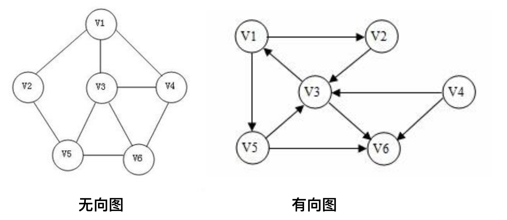

**阶**：图中顶点个数，例如左图是6阶图

**度(无向图)**：与顶点关联的边的条数，例如左图中 V3 顶点的度是 3

**出度(有向图)**：有向图中指向顶点边的个数，例如右图中 V3 顶点的出度是 2

**入度(有向图)**：有向图中背离顶点边的个数，例如右图中 V3 顶点的入度是 3

# 4、图常用的存储结构

> 图常用的存储结构有：**数组(邻接矩阵)**、**邻接表**、**前向星**、有向图的**十字链表**和无向图的**邻接多重表**。

### a、数组(邻接矩阵)

**无向图**

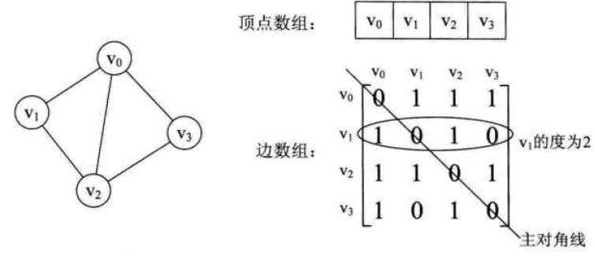

**有向图**

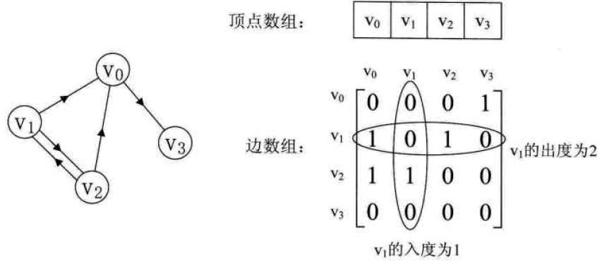

图结构由 2 个数组表示，一个一维数组表示图的顶点集合，一个二维数组表示图的边集合。

无向图中表示边的二维数组中，下标 [1,2] 和 下标 [2,1] 对应的值是顶点 V1 和 顶点 V2 之间边的权重，如果没有边则对应的值为0。

有向图中表示边的二维数组中，下标 [1,2] 对应的值表示由顶点 V1 出发到顶点 V2 边的权重值,下标 [2,1] 对应的值是由顶点 V2 出发到顶点 V1 边的权重值。

### b、邻接表

**无向图**

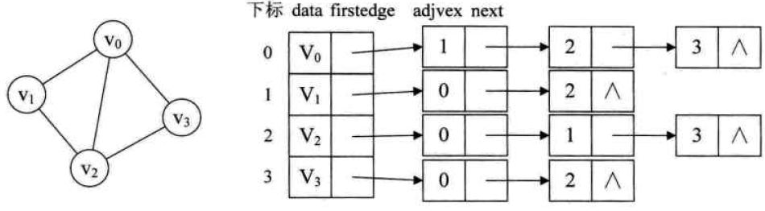

**有向图**

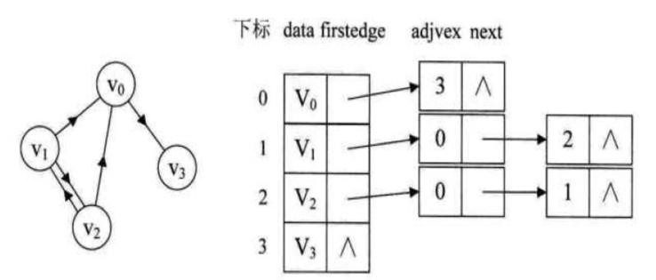

```c
/* 图的邻接表存储表示 */
 #define MAX_VERTEX_NUM 20
 typedef enum{DG,DN,UDG,UDN}GraphKind; /* {有向图,有向网,无向图,无向网} */

 typedef struct ArcNode
 {
   int adjvex; /* 该弧所指向的顶点的位置 */
   struct ArcNode *nextarc; /* 指向下一条弧的指针 */
   InfoType *info; /* 网的权值指针） */
 }; /* 表结点 */

 typedef struct
 {
   VertexType data; /* 顶点信息 */
   ArcNode *firstarc; /* 第一个表结点的地址,指向第一条依附该顶点的弧的指针 */
 }VNode,AdjList[MAX_VERTEX_NUM]; /* 头结点 */

 typedef struct
 {
   AdjList vertices;
   int vexnum,arcnum; /* 图的当前顶点数和弧数 */
   GraphKind kind; /* 图的种类标志 */
 }ALGraph;
```

# 5、迪杰斯特拉算法定义及思想

> 迪杰斯特拉算法（Dijkstra's algorithm），由荷兰计算机科学家艾兹赫尔·戴克斯特拉在1956年提出。戴克斯特拉算法使用了**广度优先搜索**解决赋权有向图的单源最短路径问题。

**算法思想：**

> **这个算法是通过为每个顶点 *v* 保留当前为止所找到的从s到v的最短路径来工作的。**初始时，原点 s 的路径权重被赋为 0 （*d[s]* = 0）。若对于顶点 m 存在能直接到达的边（s,m），则把d[m]设为w（s, m）,同时把所有其他（s不能直接到达的）顶点的路径长度设为无穷大，即表示我们不知道任何通向这些顶点的路径（对于所有顶点的集合 *V* 中的任意顶点 *v*， 若 *v* 不为 *s* 和上述 *m* 之一， *d[v]* = ∞）。当算法结束时，*d[v]* 中存储的便是从 *s* 到 *v* 的最短路径，或者如果路径不存在的话是无穷大。

**算法步骤：**

G={V,E}，V 表示顶点集合，E 表示边集合

1. 初始时令 S={V0},T=V-S={其余顶点}，T中顶点对应的距离值

   若存在<V0,Vi>，d(V0,Vi)为<V0,Vi>弧上的权值

   若不存在<V0,Vi>，d(V0,Vi)为∞

2. 从 T 中选取一个与 S 中顶点有关联边且权值最小的顶点 W，加入到 S 中

3. 对其余 T 中顶点的距离值进行修改：若加进 W 作中间顶点，从 V0 到 Vi 的距离值缩短，则修改此距离值

4. 重复上述步骤2、3，直到 S 中包含所有顶点，即 W = Vi 为止


# 6、迪杰斯特拉算法基于数组存储结构执行过程示例

**初始状态**

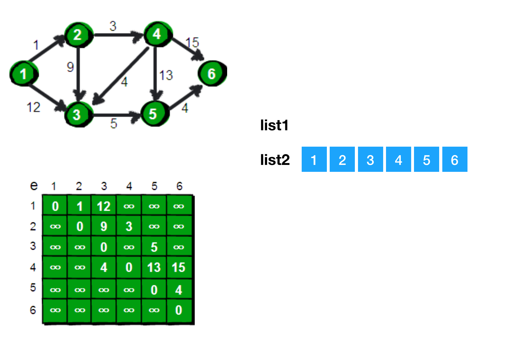

**选定起始点**

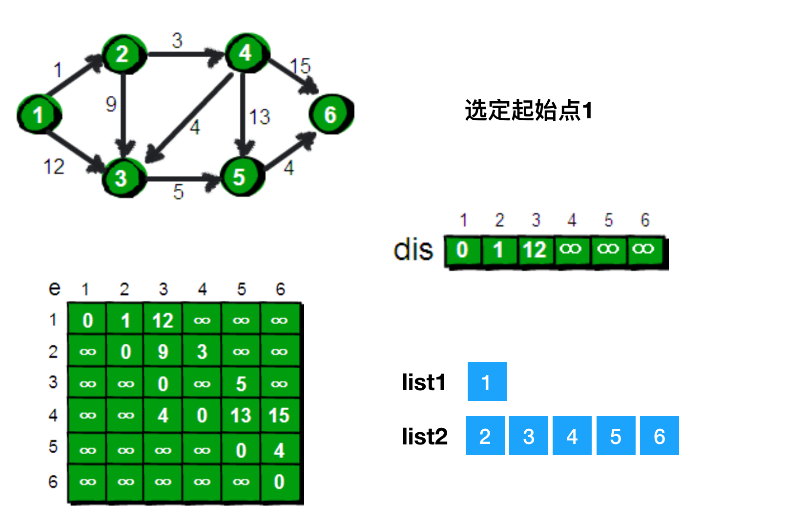

**第一次寻找 dis 中距离最近且未被遍历的点**

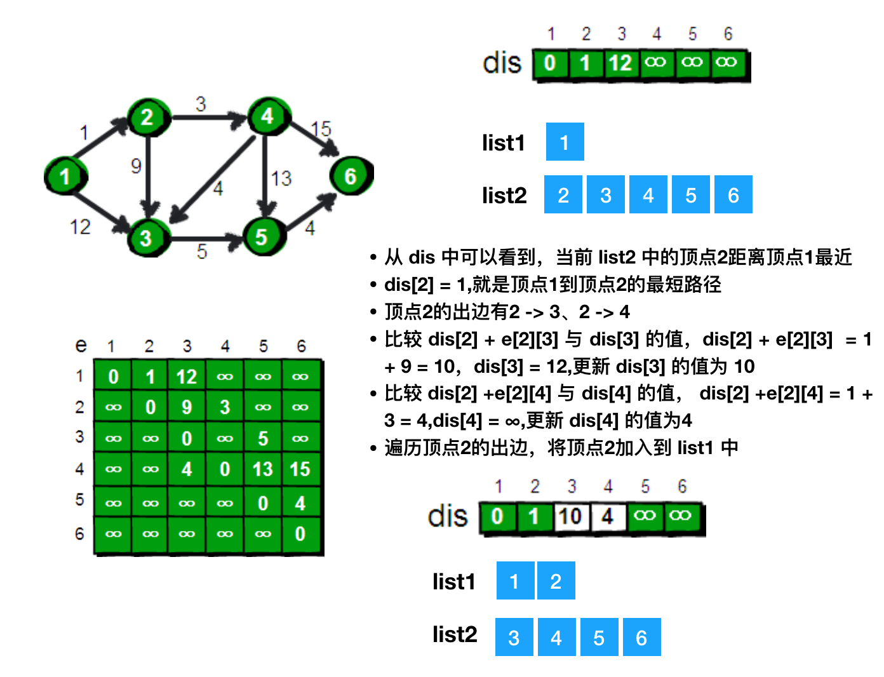

**第二次寻找 dis 中距离最近且未被遍历的点**

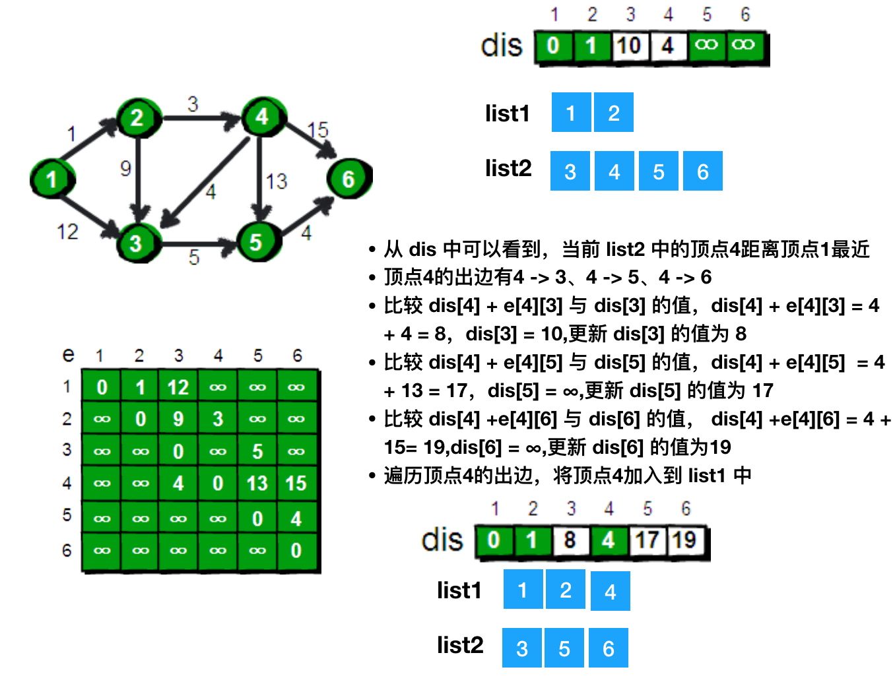

**第三次寻找 dis 中距离最近且未被遍历的点**

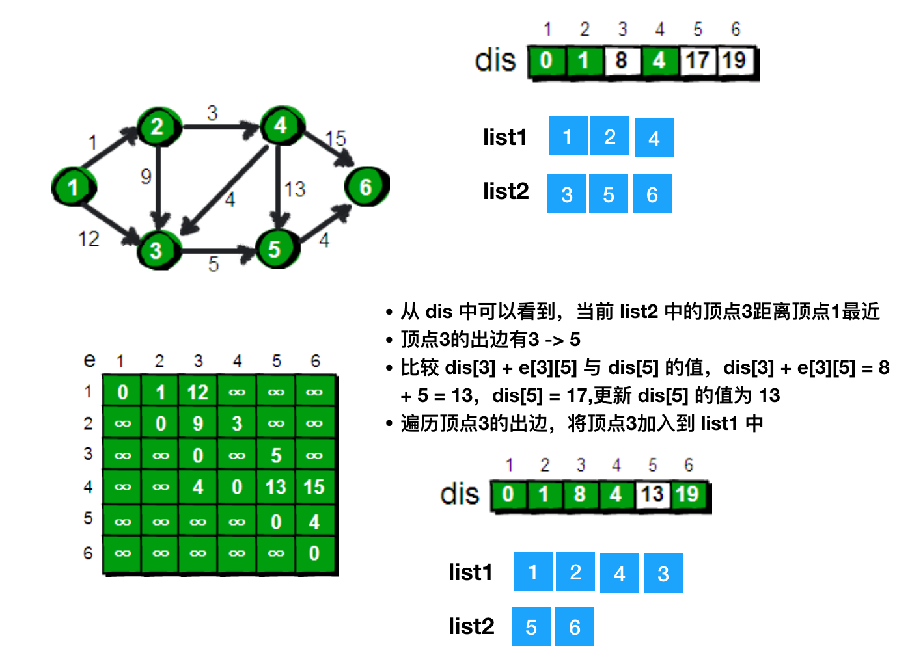

**第四次寻找 dis 中距离最近且未被遍历的点**

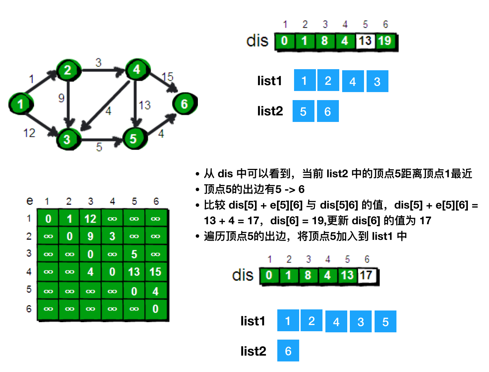

**第五次寻找 dis 中距离最近且未被遍历的点**

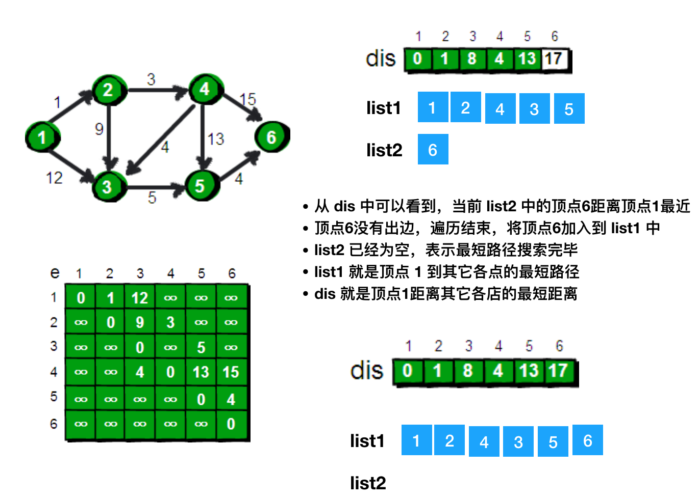

**循环结束，dis 记录起始点距离其它各点的最短距离，list1 记录最短路径。**寻找起始顶点1 到顶点 n 的最短距离直接查询 dis[n] 对应的值；寻找顶点 1 到 顶点 n 最短路径则从左到右遍历 list1 中的值，直到寻到 n 为止，遍历过的点就是最短路径。如顶点 1 到顶点5 的最短距离是 13，最短路径是 1 - 2 - 4 - 3 - 5;顶点 1 到顶点 4 的最短距离是 4，最短路径是 1 - 2 - 4。

# 7、算法实现

```c
#include<stdio.h>
#include<stdlib.h>
#define max1 10000000  //原词条这里的值太大，导致溢出，后面比较大小时会出错
int a[1000][1000];
int d[1000];//d表示源节点到该节点的最小距离
int p[1000];//p标记访问过的节点
int i, j, k;
int m;//m代表边数
int n;//n代表点数
int main()
{
    scanf("%d%d",&n,&m);
    int    min1;
    int    x,y,z;
    for(i=1;i<=m;i++)
    {
        scanf("%d%d%d",&x,&y,&z);
        a[x][y]=z;
        a[y][x]=z;
    }
    for( i=1; i<=n; i++)
        d[i]=max1;
    d[1]=0;
    for(i=1;i<=n;i++)
    {
        min1 = max1;
        //下面这个for循环的功能类似冒泡排序，目的是找到未访问节点中d[j]值最小的那个节点，
        //作为下一个访问节点，用k标记
        for(j=1;j<=n;j++)
            if(!p[j]&&d[j]<min1)
            {
                min1=d[j];
                k=j;
            }
        //p[k]=d[k]; // 这是原来的代码，用下一 条代码替代。初始时，执行到这里k=1，而d[1]=0
       //从而p[1]等于0，这样的话，上面的循环在之后的每次执行之后，k还是等于1。
        p[k] = 1; //置1表示第k个节点已经访问过了
        for(j=1;j<=n;j++)
            if(a[k][j]!=0&&!p[j]&&d[j]>d[k]+a[k][j])
                d[j]=d[k]+a[k][j];
    }
    //最终输出从源节点到其他每个节点的最小距离
    for(i=1;i<n;i++)
        printf("%d->",d[i]);
    printf("%d\n",d[n]); 
    return 0;
}
```

从上面算法分析，这种实现算法的时间复杂度为O(n^2)。